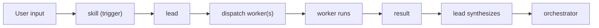

---
triggers:
  files: [".cursor/agents/**", "docs/leads/**", "AGENT.md"]
  change_types: ["create", "modify"]
  keywords: ["agent", "orchestrator", "lead", "worker", "subagent"]
---

# Agent Strategy

High-level reference for the agent system: orchestrator, leads, workers, and how they interact.

## Orchestrator

The **orchestrator** is the session-model agent (the main Cursor agent in a chat). It:

- Interprets user intent and decides whether a skill applies or to use the default path.
- Chooses skills when the user invokes them (e.g. `/plan`, `/work`, `/investigate`); otherwise defaults to **generalPurpose**.
- Dispatches **leads** (when a skill creates one) and **workers** (task-level executors).
- Coordinates only: it does not perform bounded implementation work except as **fallback** after a worker has failed twice on the same task.

See [AGENT.md](../AGENT.md) and [.cursor/rules/subagent-dispatch.mdc](../.cursor/rules/subagent-dispatch.mdc) for execution protocol.

## Leads

**Leads** are specialized orchestration patterns created when a skill is invoked. A lead:

- Receives a directive from the orchestrator (e.g. “run investigation”, “create a plan”, “execute plan tasks”).
- Dispatches **workers** to do the actual work.
- Synthesizes results and reports back.

Leads are defined by skills and documented in **docs/leads/**. Examples:

| Lead            | Skill / trigger | Role                                                                |
| --------------- | --------------- | ------------------------------------------------------------------- |
| Investigator    | `/investigate`  | Run investigation, dispatch investigator worker, produce plan/tasks |
| Planner-analyst | `/plan`         | Gather context, dispatch planner-analyst, produce plan              |
| Execution       | `/work`         | Run task loop, dispatch implementer + reviewer                      |
| Test-review     | `/test-review`  | Audit tests, dispatch test scanners, synthesize findings            |

See [docs/leads/README.md](leads/README.md) for the lead registry.

## Workers

**Workers** are task-level executors. They do bounded work; they do not orchestrate other agents. Examples:

- **implementer** — Executes a single task from the task graph (start → work → done).
- **reviewer** — Evaluates an implementation against the task spec.
- **explorer** — Codebase exploration (quick / medium / thorough).
- **spec-reviewer** — Reviews specs or plan structure.
- **quality-reviewer** — Quality checks on deliverables.
- **Test scanners** — test-coverage-scanner, test-infra-mapper, test-quality-auditor.

Worker prompts live in [.cursor/agents/](.cursor/agents/); see [.cursor/agents/README.md](../.cursor/agents/README.md).

## Communication: Notes as Cross-Dimensional Transmission

Agents operate in two fundamentally different perspectives:

- **Introspective** — A worker (implementer) sees one task. It has intent, files, suggested changes — a self-contained world. Its scope is bounded by the task.
- **Connective** — The orchestrator (or a future worker on a related task) sees many tasks. It cares about patterns, conflicts, repeated failures, and architectural drift across the task network.

**Notes (`tg note`) are the boundary-crossing mechanism between these two perspectives.** When an implementer hits something unexpected — a fragile migration, a conflicting pattern, an assumption that doesn't hold — it writes a note. That note is written introspectively (one agent, one task) but its value is connective (relevant to every task touching the same area).

The `event` table stores notes as task-scoped rows (`kind = 'note'`), but the _meaning_ of a note is inherently cross-task. `tg context` surfaces notes from sibling tasks in the same plan so that the connective dimension can read what the introspective dimension wrote. Without this surfacing, notes are trapped in the task that created them.

**When to write notes:**

- Discovered fragility or unexpected behavior in shared code
- Pattern conflicts between what the task says and what the codebase does
- Environment or tooling issues the implementer couldn't fix
- Warnings for future tasks touching the same files
- Review verdicts (structured JSON for `tg stats`)

See [multi-agent.md](multi-agent.md) for event body conventions and [schema.md](schema.md) for the `event` table structure.

## Hive coordination: context ping as impetus

**Pinging for context drives communication.** When a sub-agent calls for shared context (e.g. `tg context --hive --json` when available), that call is the impetus for a small coordination loop:

1. **Read the group** — Consume the hive snapshot (all doing tasks: agents, phases, files in progress, recent notes).
2. **Reflect on self** — Given that context, is there anything the hive should consider from _my_ local context? Should I absorb something from another task’s notes or heartbeat?
3. **Reflect on self again** — Given _my_ local context (files, discoveries, blockers), is there anything on _other_ tasks in the hive that would benefit from an update? If yes, write it via `tg note <otherTaskId> --msg "..."` so the connective dimension gets the signal.

So the flow is: **read group → reflect on self → (optionally) update the group** (or specific tasks in it) by adding notes. That’s a bi-directional check: first ingest, then consider whether to contribute back.

This is a **methodology agents can evolve**. No single rigid procedure is mandated. Sub-agents are encouraged to experiment with when to ping for context, how to interpret the hive snapshot, and when to note on other tasks. Learnings that work (e.g. “note on sibling task when touching same file”, “ping after start and before pre-done”) should be shared via the [agent utility belt](../.cursor/agent-utility-belt.md) so the pattern improves over time.

## Micro-Cluster Model

When the human spawns multiple `/work` instances, they coordinate via a **shared situation report (sitrep)**. Each instance reads the same sitrep (e.g. `reports/sitrep-YYYY-MM-DD-HHmm.md`), sees the recommended **formation** (which lead roles to fill and how many), and **self-selects** an available role. Key principles (drawn from production multi-agent patterns):

1. **Shared situation report** — All instances read the same sitrep as coordination state (publish + observe; no central negotiator).
2. **Fresh agent per role** — Each `/work` instance starts with clean context and picks one role; no context pollution across roles.
3. **Coordinator never executes** — The overseer role (when filled) monitors and coordinates but does not implement tasks.
4. **Formation over negotiation** — The sitrep defines the formation; each agent claims a slot. Agents do not negotiate roles with each other.
5. **Cardinality constraints** — Each role has min/max instances (e.g. overseer = 0–1, execution-lead = 1–N), so the human can size the cluster by how many `/work` invocations they start.

The human decides how many leads to run. Each instance self-orients from the sitrep and enters the appropriate workflow (execution loop, overseer/watchdog, investigator-lead, or planner-lead). See [docs/leads/README.md](leads/README.md) (Sitrep and Formation) and [docs/multi-agent.md](multi-agent.md) (Formation and Slots).

## generalPurpose Default

When the user asks something **without** invoking a skill:

- The orchestrator uses **generalPurpose**: there is no lead.
- The orchestrator either dispatches a worker (e.g. generalPurpose, explorer) or does the work directly, depending on the request.

No skill ⇒ no lead ⇒ generalPurpose path.

## Decision Tree

1. **User invokes a skill** (e.g. `/plan`, `/work`, `/investigate`) → skill runs → skill creates a **lead** → lead **dispatches workers** → lead synthesizes and reports.
2. **User asks without a skill** → **generalPurpose**: orchestrator handles via direct dispatch or direct execution, no lead.

## Skill to lead to worker flow

When a skill is invoked, the orchestrator runs the skill; the skill implements a **lead** pattern that dispatches one or more **workers** and then synthesizes their results. Per-skill decision trees live in `.cursor/skills/`; the generic flow is:

## File Layout

| Location                 | Purpose                                                                                           |
| ------------------------ | ------------------------------------------------------------------------------------------------- |
| **.cursor/agents/\*.md** | Prompt templates for workers (and any lead-capable agents). One file per agent type.              |
| **docs/leads/\*.md**     | Documentation of **orchestration patterns** (how a lead is invoked, which workers it uses, flow). |
| **docs/leads/README.md** | Lead registry and index.                                                                          |

Agent files define _who_ does the work; lead docs explain _how_ orchestration runs for each pattern. See [docs/leads/README.md](leads/README.md) and [.cursor/agents/README.md](../.cursor/agents/README.md).
