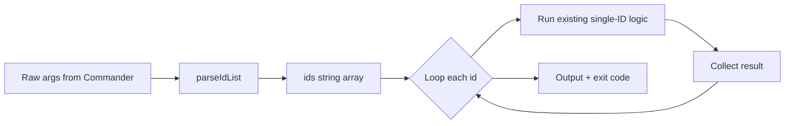

## Analysis

The CLI currently accepts a single entity ID per command for `done`, `start`, `cancel`, and `note`. Running the same operation for many IDs (e.g. marking 60 imported tasks done with the same evidence) requires N invocations. Batching improves UX and scripting: one invocation with multiple IDs, with the same options applied to all.

**Design decisions**

- **ID input:** Support both **variadic positionals** (`tg done id1 id2 id3`) and **comma-separated** in one token (`tg done "id1,id2,id3"`) by normalizing the raw argument list: for each element, split on `,`, trim, drop empty; flatten to `string[]`. Commander’s `.argument("<ids...>", "...")` yields an array; a single ID becomes `["id1"]`, so backward compatibility is preserved.
- **Execution:** Sequential per ID; same options (e.g. `--force`, `--evidence`) apply to every ID. No parallel execution in v1.
- **Output and exit code:** Human-readable: one line per ID (success or error). With `--json`, output an array of `{ id, status?, error? }`. Exit code **1 if any** operation fails, so scripts can detect partial failure.
- **Scope:** Implement batch for the four write commands (done, start, cancel, note). Optional follow-up: batch read for `context` and `show` (same ID parsing, combined or per-ID output).

**Dependencies**

- Shared `parseIdList(raw: string[]): string[]` in `src/cli/utils.ts` so all batch commands use the same convention. Empty result → caller shows usage/error and exits.
- Each command refactor is independent after the helper exists; docs and integration tests depend on the four command changes.

## Proposed changes

1. **utils.ts**
   - Add `parseIdList(raw: string[]): string[]`: flatten `raw.map(s => s.split(",").map(t => t.trim()).filter(Boolean))`. No export change if utils already re-exported; callers import from `./utils`.

2. **done / start / cancel / note**
   - Replace `.argument("<taskId>", ...)` (or `<id>`) with `.argument("<ids...>", "One or more IDs (space- or comma-separated)")`.
   - In action: `const ids = parseIdList(idsFromCommander); if (ids.length === 0) { console.error("..."); process.exit(1); }`.
   - Loop: `for (const id of ids) { ... existing single-ID logic, push result to array ... }`.
   - After loop: if any failure, `process.exit(1)`; output human lines or `--json` array.

3. **context / show (optional)**
   - Same variadic + parseIdList; output can be one block per ID (human) or JSON array. Defer to a follow-up if time-boxed.

4. **Docs**
   - cli-reference.md: for each batch command, state that multiple IDs are allowed (space or comma-separated), options apply to all, exit 1 if any fail, and describe `--json` array shape.

5. **Tests**
   - Integration: `tg done <id1> <id2>`, `tg done "id1,id2"`, single ID; one test with an invalid ID in the batch to assert exit 1 and per-id error in output/JSON.

## Mermaid: Batch flow (single command)

## Open questions

- None; exit code and --json shape are decided (exit 1 if any fail; --json array with per-id status/error).

<original_prompt>
It occurs to me our cli should be made to be able to handle arrays of ids for these kinds of operations. Can you make a plan to update the cli to support batch operations? Example: "tg done id" could become "tg done id1 id2 id3" or "tg done id1,id2,id3". Make a plan reviewing cli operations that could benefit from such batching operations.
</original_prompt>
