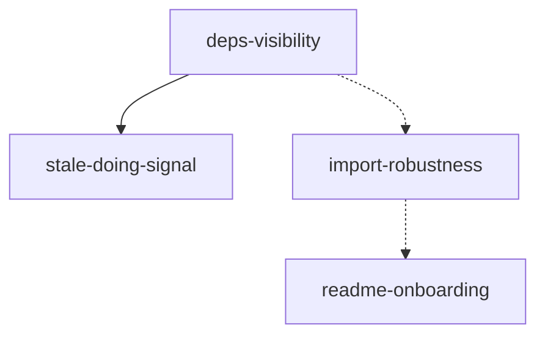

## Analysis

This plan addresses four follow-ups from the zoom-out after multi-agent centaur: (1) Beads-style dependency visibility for a single task, (2) robust re-import of Cursor plans when junction tables exist, (3) surfacing stale "doing" tasks so they don’t get forgotten, and (4) better onboarding (README + optional health check).

### Why these four

- **Deps visibility**: We have full-graph mermaid/dot and `tg show` with blockers/dependents as lists. A focused tree (blockers above, dependents below) for one task avoids opening the full graph and matches Beads’ `bd dep tree` idea.
- **Import robustness**: The multi-agent plan import failed partway (task_domain DELETE), so only one task was created. Re-import and updates must work when task_domain/task_skill are in use.
- **Stale doing**: Recovery (tg done --evidence "completed previously") exists, but there’s no proactive signal. A simple “these tasks have been doing a long time” reduces drift.
- **Onboarding**: New users and agents need a clear path (plan → import → execute) and a way to confirm the environment (optional tg doctor).

### Dependency graph

- `stale-doing-signal` is blocked by `deps-visibility` only to reuse status/event awareness; it could be relaxed if we implement stale first.
- `import-robustness` and `readme-onboarding` are independent and can run in parallel with deps.

## Proposed changes (summary)

| Task | Key files | Approach |
|------|-----------|----------|
| deps-visibility | cli/deps.ts (new), show.ts or index.ts | Query edges + task; print tree; optional depth limit |
| import-robustness | plan-import/importer.ts | Fix task_domain/task_skill cleanup; add re-import test |
| stale-doing-signal | cli/status.ts or cli/stale.ts | Query doing tasks + max(event.created_at); compare to threshold |
| readme-onboarding | README.md, cli/doctor.ts (optional) | Links, "what to do next", doctor = config + Dolt + schema check |

## Risks (expanded)

- **Import**: Deleting and re-inserting junction rows during re-import may hit FK or ordering issues. Mitigation: upsert-style updates or delete only rows that are no longer in the new spec; integration test with two consecutive imports.
- **Deps tree**: Very large graphs could make the tree huge. Mitigation: depth limit (e.g. 3), optional `--depth N`, document in CLI reference.
- **Stale**: A single threshold (e.g. 24h) might flag legitimate long-running work. Mitigation: treat as advisory; consider env/config for threshold later.

## Testing strategy

- **deps**: Integration test that creates a small graph (A blocks B blocks C), runs `tg deps <B>`, asserts blockers and dependents appear in output.
- **import**: Integration test that imports a Cursor plan, then re-imports the same plan (e.g. one task title changed); assert no failure and correct task count and junction data.
- **stale**: Integration test that starts a task, optionally mocks or advances time, runs tg status or tg stale, asserts stale task appears (or stub with “doing” list only).
- **doctor**: Unit or integration test that tg doctor exits 0 in initialized repo and exits 1 with clear message when config or Dolt is missing.

## Open questions

- Whether to add `tg stale` as a separate command or only extend `tg status` with a "Stale:" line.
- Whether tg doctor should live in this plan or a follow-up (optional scope).

<original_prompt>
ok make me a plan
</original_prompt>
