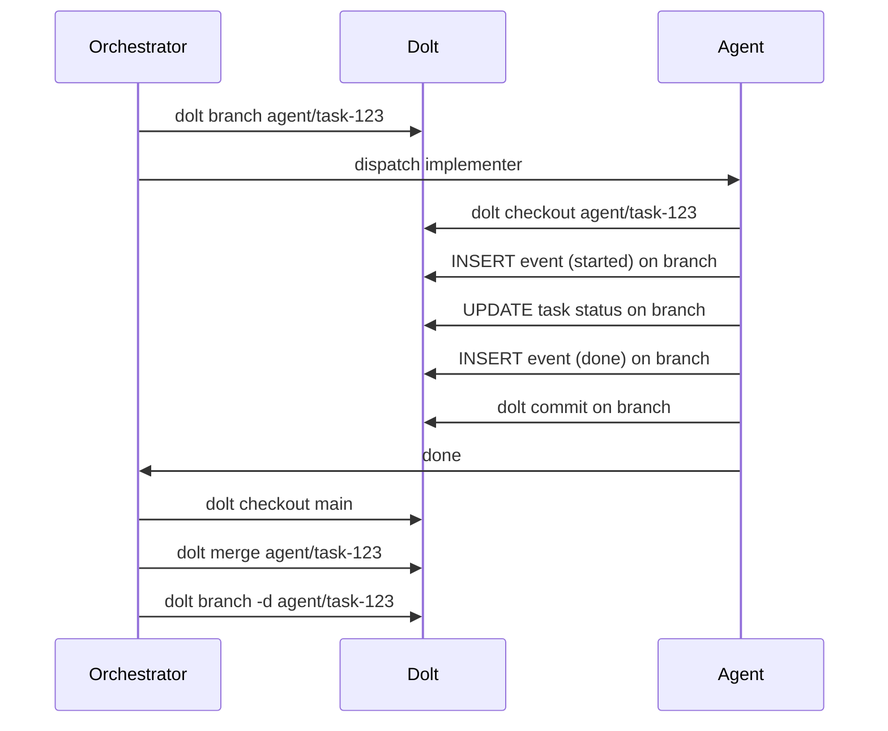

## Analysis

DoltHub's "YOLO to FAFO" blog post argues that version-controlled database branches enable agents
to safely experiment - they can make changes on a branch, and if something goes wrong, the branch
is simply deleted. Task-Graph uses Dolt but currently all agents commit to the same working branch.

With branch-per-agent, each implementer's task graph mutations (status changes, events) happen on
an isolated branch. On successful completion, the branch is merged to main. On failure, it's
deleted — zero impact on the shared state.

## Branch flow

## Dolt merge behavior

Dolt does cell-level merge (not line-level like git). Since different agents modify different task
rows, conflicts are extremely unlikely. The main risk is two agents updating the same row (e.g.
both updating a shared plan's status), which should be prevented by the dispatch rule's file
conflict check.

<original_prompt>
Have implementer agents work on Dolt branches for safe rollback,
inspired by DoltHub's "YOLO to FAFO" pattern for agentic workflows.
</original_prompt>
