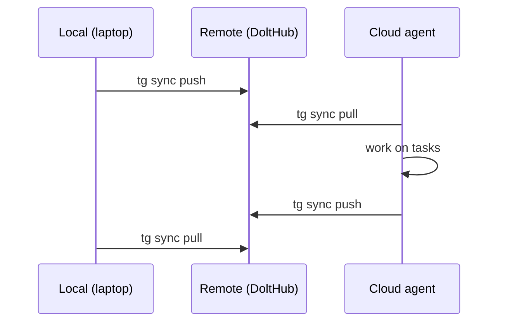

## Analysis

Beads syncs across machines via Dolt push/pull. Task-Graph is currently local-only. For workflows
spanning multiple machines (e.g. laptop for planning, cloud VM for CI-driven agents), replication
enables a shared task graph.

Dolt replication is built-in — `dolt remote add`, `dolt push`, `dolt pull` work like git. The CLI
just needs a thin wrapper.

## Sync flow

## Remote options

| Remote type | URL format                                    | Use case                 |
| ----------- | --------------------------------------------- | ------------------------ |
| DoltHub     | `https://doltremoteapi.dolthub.com/user/repo` | Cloud-hosted, easy setup |
| File-based  | `file:///path/to/remote`                      | Local network, testing   |
| Self-hosted | Custom Dolt remote API                        | Enterprise, air-gapped   |

<original_prompt>
Enable Dolt push/pull for multi-machine task graph sync,
inspired by Beads' Dolt-native replication model.
</original_prompt>
