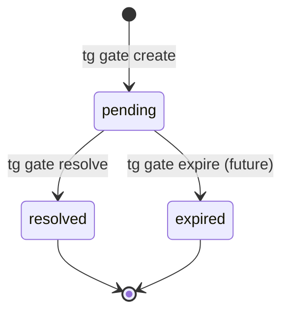

## Analysis

Task-Graph's `tg block` command only supports task-on-task blocking. But real workflows often block
on external conditions: "wait for human approval", "wait for CI to pass", "wait for PR to merge".
Beads solves this with "gates" - async coordination primitives that represent external conditions.

Starting with human gates (manual resolve) keeps the implementation simple. Automated gates
(CI webhooks, GitHub events) can be added later as extensions.

## Gate lifecycle

When a gate is created for a task:

1. Task status → blocked
2. Gate appears in `tg status` and `tg gate list`
3. Human (or future automation) runs `tg gate resolve <id>`
4. Task status → todo (if no other blockers)

<original_prompt>
Add gate primitives that block tasks on external events,
inspired by Beads' gate system (human, timer, GitHub gates).
</original_prompt>
