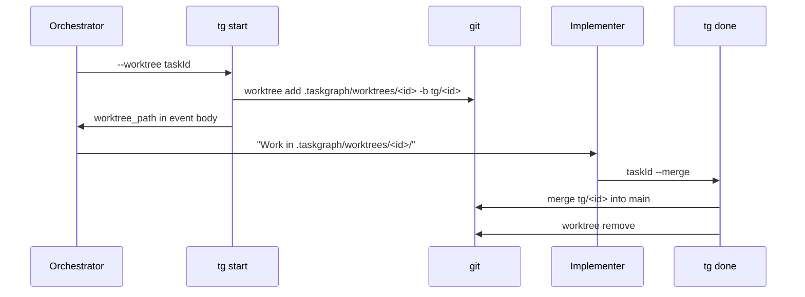

## Analysis

Currently, parallel implementers share the working directory. The dispatch rule warns about file
conflicts and falls back to sequential execution when tasks might touch the same files. Superpowers
and Gastown both use git worktrees to give each agent an isolated workspace.

Git worktrees are lightweight - they share the same `.git` object store but have separate working
directories and branches. This eliminates file conflicts entirely for parallel work.

## Proposed flow



## Configuration

Opt-in via `.taskgraph/config.json`:

```json
{ "useWorktrees": true }
```

When enabled, `tg start` auto-creates worktrees. When disabled (default), behavior is unchanged.

<original_prompt>
Integrate git worktrees so parallel implementers work in isolated branches,
inspired by Superpowers and Gastown's worktree isolation patterns.
</original_prompt>
