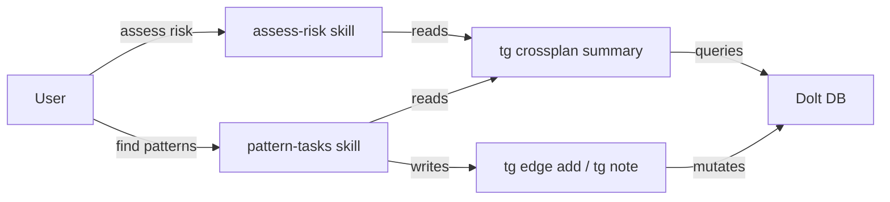

## Analysis

We have 61 tasks across 10 plans loaded in Dolt. Before executing, there's a valuable meta-planning
step: understanding how plans interact, where they conflict, and what order minimizes friction.

### Current infrastructure

`tg portfolio overlaps` and `tg portfolio hotspots` exist but work on `feature_key` and `area` —
neither of which our new plans use heavily. The cross-plan analysis needs to work on **domains**,
**skills**, and **file_tree** overlaps, which are the dimensions our plans actually populate.

### Data landscape (current 61 tasks)

**Domain hotspots**: `cli` appears in 9/10 plans (18 tasks). `schema` in 3 plans (5 tasks).
**Skill hotspots**: `documentation-sync` in all 10 plans (12 tasks). `cli-command-implementation`
in 8 plans (11 tasks). `integration-testing` in 8 plans (8 tasks).

This tells us:

- Doc tasks across plans could potentially be batched
- CLI command tasks share conventions and should reference each other
- Schema tasks (hash IDs, gates, branches) have ordering implications

### The two skills

**assess-risk** (read-only): Applies Greg's structured risk framework to the loaded plans.
Produces a per-plan risk matrix and a cross-plan interaction analysis. Intended to run first.

**pattern-tasks** (read-write): Enriches the task graph with cross-plan edges and notes.
Finds file overlaps, domain clusters, architectural opportunities, and optimal execution order.
Runs after risk assessment, armed with risk context.

### Why a `tg crossplan` CLI command?

The skills are agent instructions — they tell the agent _what_ to do. But the agent needs _data_
to work with. Rather than having the agent compose raw SQL queries each time, a `tg crossplan`
command provides a stable, tested interface for cross-plan analysis. The skills invoke it.

### Typical workflow

1. Load plans → `tg import` (done)
2. Risk assessment → invoke assess-risk skill → produces report
3. Pattern recognition → invoke pattern-tasks skill → proposes and writes edges
4. Execute → begin task execution with enriched graph

<original_prompt>
Create two invokable skills:

1. assess-risk — Greg's risk assessment framework applied to loaded plans (read-only)
2. pattern-tasks — Cross-plan task enrichment: find overlaps, propose edges, enrich tasks (read-write)
   Plus a tg crossplan CLI command to support both skills with structured cross-plan queries.
   </original_prompt>
