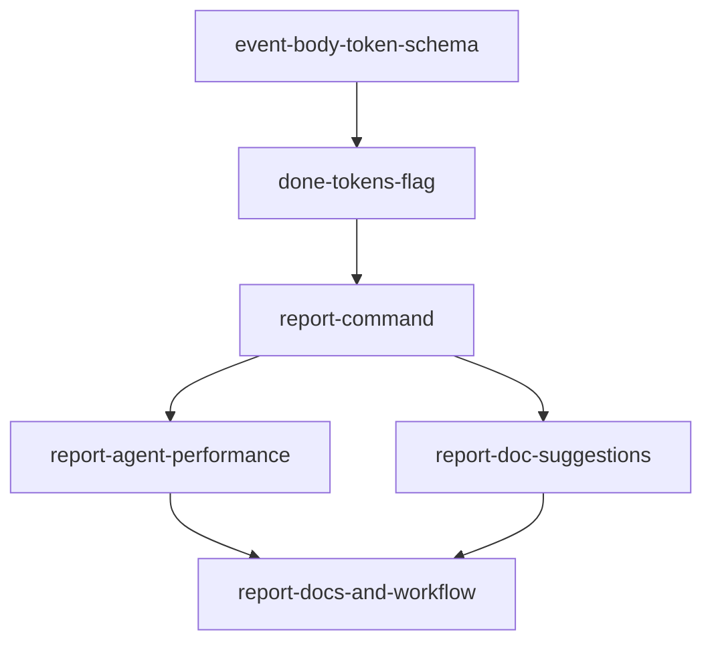

## Analysis

Post-execution reporting gives visibility into what happened after a plan is run: who did what, how much token usage (if provided), and where to improve agents and docs. The planner-analyst sub-agent was dispatched first to gather codebase context; this plan is based on that analysis.

**Relevant context (from planner-analyst):**

- Events: `started` has `{ agent, timestamp }`; `done` has `{ evidence, checks, timestamp }`. No token data today.
- Agent attribution for done tasks = latest `started` event per task. No migration needed to add optional keys to event body.
- Token data must be supplied by caller (e.g. `tg done --tokens '...'`); CLI has no access to Cursor usage.
- Doc suggestions can be derived from task_domain / task_skill vs existing `docs/` and `docs/skills/` files.

## Proposed approach

1. **Schema** — Document optional `usage` (or `input_tokens`/`output_tokens`) on `done` (and optionally `started`) in docs/schema.md.
2. **Capture** — `tg done --tokens '<json>'` merges into done event body; backward compatible.
3. **Report command** — `tg report --plan <id>` aggregates done tasks, agent per task (from latest started), evidence, and optional token sums; outputs human-readable summary (+ optional --json).
4. **Agent performance** — Report section: per-agent task counts; heuristic "sub-agent improvement" suggestions (e.g. tasks with many notes or thin evidence).
5. **Doc suggestions** — Report section (or separate command): list domains/skills used by tasks vs existing docs; suggest missing or to-review docs.
6. **Docs and workflow** — cli-reference, schema, and workflow rule updated; optionally recommend `tg report` after plan completion.

## Dependency graph

## Open questions

- Whether to add optional token capture on `tg start` (e.g. session-level input tokens) or only on `done`.
- Whether doc suggestions should be part of `tg report` or a separate `tg doc-suggestions` (or both: report includes a short section; doc-suggestions is detailed).

<original_prompt>
Better reporting after a plan has been executed: token spend and token efficiency; checking over agents' performance and identifying improvements for sub-agents; suggestions for improvements to docs. Create a plan for this. (Planning stage should use the planner-analyst sub-agent.)
</original_prompt>
