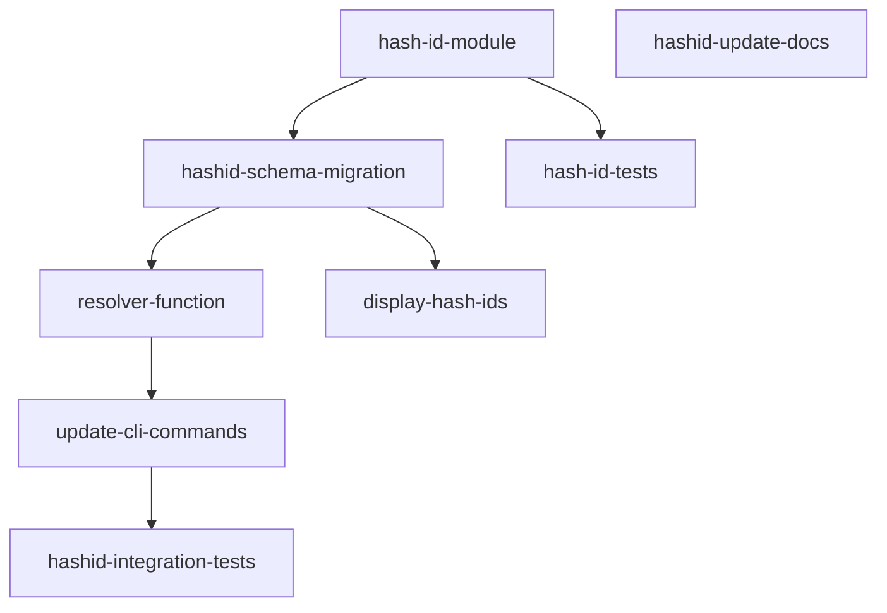

## Analysis

Task-Graph currently uses UUID v4 for all entity IDs (`CHAR(36)`). While collision-safe, UUIDs are
painful for CLI usage — copying `a1b2c3d4-e5f6-7890-abcd-ef1234567890` from `tg status` output is
error-prone. Beads solved this with short hash-based IDs (`bd-a1b2`).

The approach: derive a short deterministic hash from the UUID (not replace it). The UUID remains the
primary key in Dolt. A new `hash_id` column stores the short form. A resolver function in the CLI
layer accepts either format.

## Proposed approach

```
UUID: a1b2c3d4-e5f6-7890-abcd-ef1234567890
       ↓ SHA-256 → take first 6 hex chars
hash_id: tg-a1b2c3
```

6 hex chars = 16.7M unique values. Collision probability is negligible for project-scale task counts
(typically <1000). On collision, append additional chars.

## Dependency graph



`hash-id-tests`, `display-hash-ids`, and `update-docs` can run in parallel with other branches.

<original_prompt>
Add short hash-based task IDs (like Beads' bd-a1b2 format) to Task-Graph for CLI ergonomics.
Pattern extracted from steveyegge/beads.
</original_prompt>
