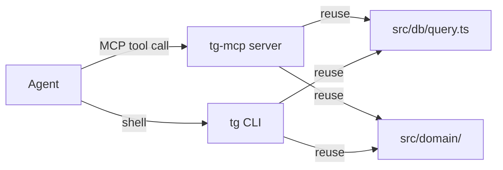

## Analysis

Currently agents interact with Task-Graph exclusively through `tg` CLI commands via shell execution.
This works but adds overhead: shell startup, `dolt sql` subprocess, output parsing. Dolt's own
ecosystem is moving toward MCP (dolthub/dolt-mcp). A TaskGraph MCP server would let agents call
`tg_status`, `tg_context`, etc. as native tool calls.

The MCP server is a thin wrapper - it reuses existing db/query and domain logic. No new business
logic in the MCP layer.

## Architecture

Both CLI and MCP share the same query/domain layer. The MCP server just provides a different
transport (stdio MCP protocol vs shell commands).

## MCP tool catalog

| Tool       | Params                    | Returns                                      | Read/Write |
| ---------- | ------------------------- | -------------------------------------------- | ---------- |
| tg_status  | plan?, domain?, skill?    | Plan/task counts, active work, next runnable | Read       |
| tg_context | taskId                    | Full context JSON                            | Read       |
| tg_next    | plan?, limit?             | Runnable task list                           | Read       |
| tg_show    | taskId                    | Task details                                 | Read       |
| tg_start   | taskId, agent             | Started event                                | Write      |
| tg_done    | taskId, evidence          | Done event                                   | Write      |
| tg_note    | taskId, message           | Note event                                   | Write      |
| tg_block   | taskId, blockerId, reason | Block edge                                   | Write      |

<original_prompt>
Create an MCP server wrapping tg commands for direct agent access,
inspired by DoltHub's dolt-mcp and the MCP ecosystem direction.
</original_prompt>
