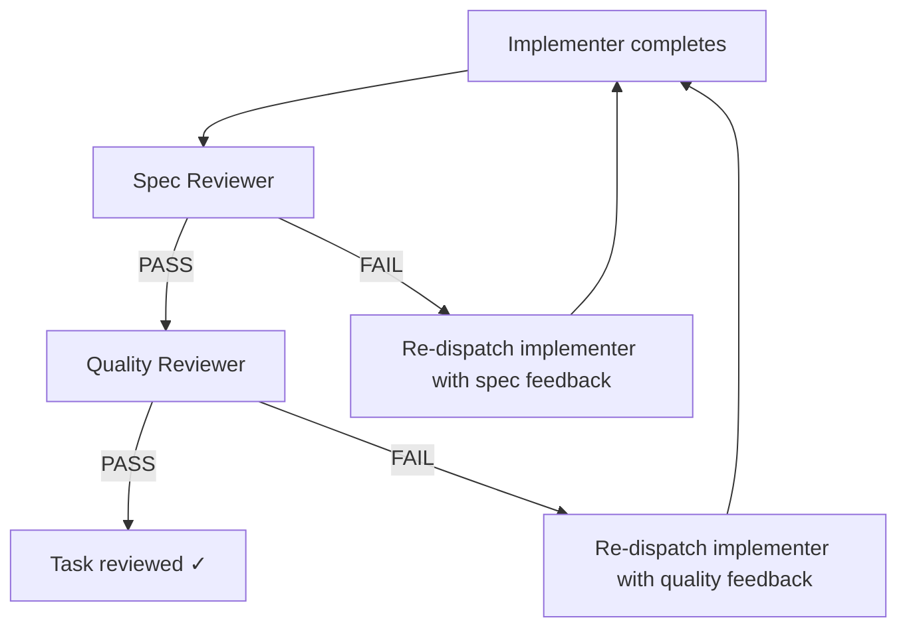

## Analysis

The current reviewer agent checks both spec compliance and code quality in one pass. This conflates
two distinct failure modes:

- "You didn't do what the task asked" (spec failure) → implementer needs to re-read intent
- "Your code has quality issues" (quality failure) → implementer needs targeted fixes

Superpowers splits these into two stages. The spec check runs first because there's no point
reviewing code quality if the implementation is off-spec. This gives the orchestrator clearer
re-dispatch feedback.

## Proposed flow

## Token cost analysis

Current: 1 reviewer call per task (always).
Proposed: 1 spec call (always) + 1 quality call (only on spec pass). Assuming ~80% spec pass rate,
average is 1.8 calls instead of 1. But each call is cheaper (narrower scope, shorter prompt).
Net increase is modest.

<original_prompt>
Split the reviewer sub-agent into spec-compliance and code-quality stages,
inspired by Superpowers' two-stage review pattern.
</original_prompt>
