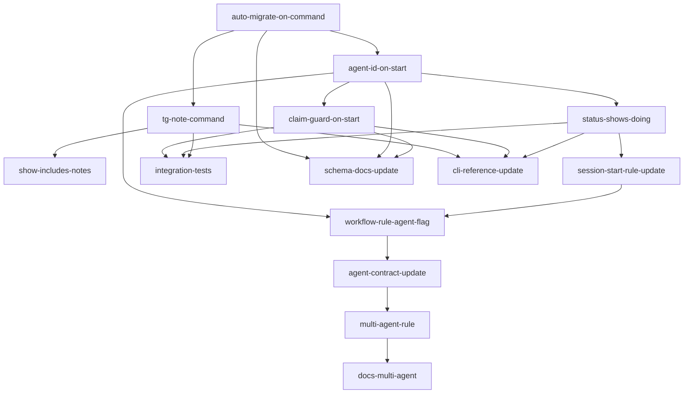

## Analysis

### Problem Statement

When 2-3 agents work simultaneously on tasks from the same Task-Graph, they
currently have no way to:
1. See what other agents are actively working on
2. Know if the schema has been migrated (leading to "two worlds" bugs)
3. Claim a task exclusively (two agents can `tg start` the same task)
4. Leave breadcrumbs for each other ("I changed this interface, heads up")

### Design Principles

- **Centaur-first**: Human plans, audits, routes. Agents execute with visibility.
- **No orchestrator**: No "mayor" or coordinator agent. The human is the coordinator.
- **Publish + observe**: Agents broadcast intent (start, note) and observe state (status). They don't negotiate with each other.
- **Append-only coordination**: Notes and events are append-only (no conflicts). Claims are idempotent check-then-set.
- **Zero config for single agent**: All multi-agent features are additive. A single agent ignoring `--agent` still works fine.

### Approach: Borrow from Beads, Skip Gastown

From **Beads** we adopt:
- **Atomic claim** (`bd update --claim` → `tg start --agent`): one agent claims, others see it
- **Structured notes** (Beads messaging → `tg note`): durable, queryable breadcrumbs
- **Ready/status visibility** (`bd ready` → enhanced `tg status`): "who is doing what" at a glance

From **Gastown** we deliberately skip:
- Mayor/orchestrator (human fills this role)
- Convoys/swarms (overkill for 2-3 agents)
- Worktrees/hooks/polecats (we share one working copy)

### Dependency Graph

### Migration Safety (the root cause fix)

The single highest-leverage change is `auto-migrate-on-command`. Today, `tg init`
runs migrations, but if an agent is spawned in a repo where init ran months ago
(before junction tables existed), every query that touches `task_domain` fails.

The fix: add a `program.hook('preAction')` in `cli/index.ts` that chains all
idempotent migrations. Cost: one `information_schema` SELECT per migration per
command (~5ms each). Benefit: no agent ever encounters a stale schema.

<original_prompt>
What I want is to be operating in Centaur most of the time. But sometimes I
spin up to 3 agents to try and move faster. I think I don't mind pairing with
3 agents. What I don't want is to delegate to them as a team that doesn't
interact with me.

Can you make a plan for improvements to our system, graph, rules and agent
directives — supporting a few agents working with me on shipping a backlog of
tasks in the taskgraph. A classic example in the future will be working with
one or two agents in planning and another 2-3 in execution.
</original_prompt>
