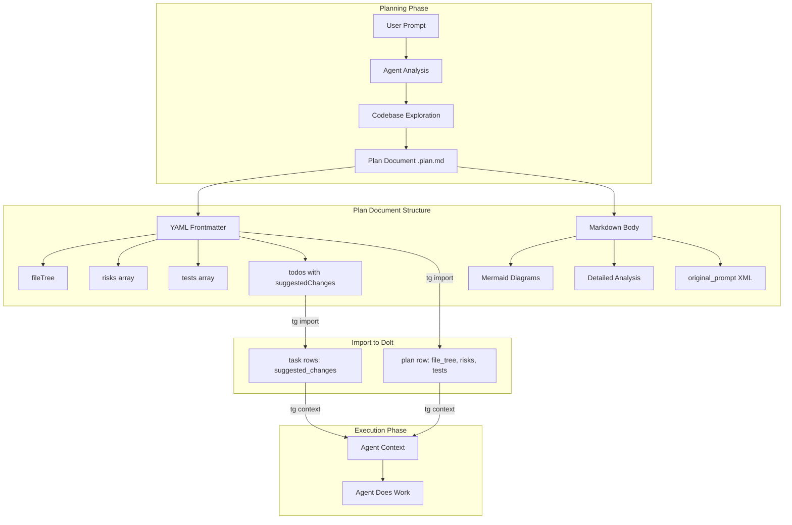
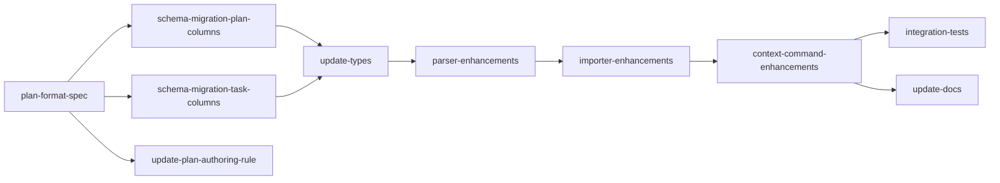

## Analysis

### The Problem

Our current plans are thin. They capture **what** to do (task titles, dependencies, domain/skill tags) but not **why** those decisions were made, **where** specifically in the codebase changes land, or **how** the agent should approach each change. The agent starts each task essentially cold — it has to rediscover the codebase context that the planner already analyzed.

Compare our current plans:

```yaml
- id: schema-migration
  content: Add domain, skill, change_type columns to the task table.
  domain: schema
  skill: sql-migration
```

With what a rich plan looks like (from the org-data-layer example):

- Exact migration code with table definitions, indexes, foreign keys
- A population script with dry-run/apply modes, pre-flight checks, transactional writes, validation
- Branching strategy and deployment sequence per environment
- Rollback plan with ordered steps
- Type definitions, CASL abilities, membership side-effects with insertion points identified
- Integration test strategy mapped to specific test files

The gap is clear: the rich plan **front-loads analysis** so execution is faster and more reliable.

### Design Principles

1. **Plans are research artifacts, not just task lists.** The plan document should contain enough analysis that an agent (or human) can understand the full picture without re-reading the codebase. This means file trees, code snippets, diagrams, and risk analysis.

2. **Structured data in YAML, narrative in markdown body.** The YAML frontmatter carries machine-parseable data (file tree, risks, tests, per-task suggested changes) that flows into Dolt. The markdown body below `---` carries free-form analysis, mermaid diagrams, and the original prompt — readable by humans and agents but not necessarily stored field-by-field.

3. **Suggested changes are directional, not prescriptive.** A suggested code change gives the agent a head start — the right file, the right function, the right approach. But the agent should adapt based on what it finds when it actually opens the file. Think of it as a sketch, not a blueprint.

4. **Risk and test identification during planning, not during execution.** Identifying risks and required tests upfront prevents "oh, I should have tested that" moments. The plan is the right time to think about what could go wrong.

5. **Original prompt preservation.** The prompt that triggered the plan is valuable context. It captures intent that may not be fully reflected in the structured plan. Always include it.

### What Changes

```
plans/
  rich_planning.plan.md          (this plan)

docs/
  plan-format.md                 (create) — format specification
  schema.md                      (modify) — new columns
  cli-reference.md               (modify) — tg context updates

tools/taskgraph/
  src/
    db/migrate.ts                (modify) — new migration functions
    domain/types.ts              (modify) — PlanSchema, TaskSchema
    plan-import/parser.ts        (modify) — extract new fields
    plan-import/importer.ts      (modify) — persist new fields
    cli/context.ts               (modify) — output new fields
  __tests__/
    integration/
      rich-plan-import.test.ts   (create) — integration tests

.cursor/rules/
  plan-authoring.mdc             (modify) — reference new format
```

### Data Flow



### Enhanced Plan Format

The enhanced Cursor plan format adds new YAML frontmatter fields while remaining backward-compatible (all new fields are optional).

#### Plan-Level Fields

```yaml
---
name: Feature Name
overview: |
  Multi-line overview with analysis...

fileTree: |
  src/
    db/migrate.ts                (modify)
    domain/types.ts              (modify)
    plan-import/parser.ts        (modify)
  __tests__/
    integration/
      new-test.test.ts           (create)

risks:
  - description: Migration could fail on existing data
    severity: high
    mitigation: Add pre-flight validation and dry-run mode
  - description: Parser changes could break existing plan imports
    severity: medium
    mitigation: Backward-compatible — all new fields are optional

tests:
  - "Import plan with fileTree, verify stored on plan row"
  - "Import plan with per-task suggestedChanges, verify stored on task rows"
  - "tg context outputs suggested_changes when present"

todos:
  - id: task-key
    content: Task title
    intent: |
      Detailed description of what this task involves and why.
      Can reference specific functions, patterns, or constraints.
    suggestedChanges: |
      ```typescript
      // In src/domain/types.ts, add to PlanSchema:
      file_tree: z.string().nullable(),
      risks: z.array(z.object({
        description: z.string(),
        severity: z.enum(['low', 'medium', 'high']),
        mitigation: z.string(),
      })).nullable(),
      ```
    blockedBy: [other-task]
    domain: schema
    skill: sql-migration
    changeType: modify
    risk: medium
---
```

#### Markdown Body Sections

Below the YAML `---` delimiter, the markdown body contains free-form analysis. Recommended sections:

1. **Analysis** — the reasoning behind the plan. What was explored, what was considered and rejected, why this approach was chosen.
2. **Proposed Changes** — detailed code snippets for complex changes, following the style of the org-data-layer plan. File paths, function signatures, key logic.
3. **Mermaid Diagrams** — for data flows, state machines, dependency graphs, or any complex business logic that benefits from visualization.
4. **Risks** — expanded discussion of risks beyond the YAML summary.
5. **Testing Strategy** — expanded discussion of testing approach.
6. **Open Questions** — unresolved items that may affect execution.

The body ends with the original prompt:

```xml
<original_prompt>
The user's original request that triggered this plan...
</original_prompt>
```

### Schema Changes

#### Plan Table — New Columns

| Column | Type | Constraints | Description |
|:-------|:-----|:------------|:------------|
| `file_tree` | `TEXT` | `NULL` | Tree of files affected by this plan |
| `risks` | `JSON` | `NULL` | Array of `{description, severity, mitigation}` |
| `tests` | `JSON` | `NULL` | Array of test descriptions to create |

#### Task Table — New Column

| Column | Type | Constraints | Description |
|:-------|:-----|:------------|:------------|
| `suggested_changes` | `TEXT` | `NULL` | Proposed code changes as a starting point |

The `task.intent` column already exists but is underused. The `intent` field from todos maps to this existing column — no schema change needed for that.

### Parser Changes

The `CursorTodo` interface gains `intent` and `suggestedChanges` optional fields.
The `CursorFrontmatter` interface gains `fileTree`, `risks`, and `tests` optional fields.
The `ParsedPlan` interface gains `fileTree`, `risks`, and `tests` fields.
The `ParsedTask` interface gains `intent` and `suggestedChanges` fields.

All existing plans continue to parse correctly — every new field is optional.

### Importer Changes

When upserting a plan row, persist `file_tree`, `risks`, `tests` if present.
When upserting task rows, persist `intent` (to `task.intent`) and `suggested_changes` if present.

### tg context Enhancements

When outputting context for a task:
- Include `suggested_changes` if the task has them
- Include `plan.file_tree` from the parent plan so the agent sees the full scope
- Include `plan.risks` so the agent is aware of known risks

### Risks

| Risk | Severity | Mitigation |
|:-----|:---------|:-----------|
| YAML frontmatter gets unwieldy for large plans with many code snippets | Medium | Keep YAML fields for structured data only; put long code snippets in the markdown body and reference them from todo `suggestedChanges` as summaries |
| Parser changes break existing plan imports | Low | All new fields are optional; existing plans are unaffected |
| `suggested_changes` text could be very large for some tasks | Low | TEXT column handles this; if it becomes a problem, consider moving to a separate table |
| Agents over-rely on suggested changes instead of reading actual code | Medium | Plan-authoring guidance explicitly states suggestions are directional, not prescriptive |

### Tests to Create

- Import a plan with `fileTree`, verify it's stored on the plan row in Dolt
- Import a plan with `risks` array, verify JSON is stored correctly
- Import a plan with `tests` array, verify JSON is stored correctly
- Import a plan with per-todo `intent`, verify it maps to `task.intent`
- Import a plan with per-todo `suggestedChanges`, verify it maps to `task.suggested_changes`
- `tg context` outputs `suggested_changes` when present on the task
- `tg context` outputs `file_tree` from the parent plan
- Existing plans (without new fields) still import correctly (backward compat)
- Round-trip: `tg import` → `tg export markdown` preserves new fields

### Implementation Order



Critical path: `plan-format-spec` → `schema migrations` → `types` → `parser` → `importer` → `context` → `tests`

Parallelizable: `update-plan-authoring-rule` can run alongside schema/types/parser work after the format spec is done.

<original_prompt>
Lets write a plan to improve our planning. It doesn't have to be exact but it should detail off some principles of approach.

Here is a plan that my business partners plan. I like it. [Organisation Data Layer Implementation plan — detailed migration code, population scripts, types, CASL abilities, membership side-effects, API endpoints, integration tests, deployment sequence, rollback plan]

I also really like how repo-prompt includes the original prompt in the plan at the bottom of the prompt context. I'm realising the plans we are producing are similar to repo-prompt in the sense that we are providing code snippets, analysing files with a high reasoning model to determine which files to include and providing snippets of proposed changes.

I also like that it creates a file tree of relevant files to be targeted.

I'd like you to make a plan to improve our planning and task creation.

Plans should have more analysis recorded into them, as well as the prompt in an xml tag at the bottom. Proposed code changes for specific files in code blocks as well as a file tree showing changes. For complex business logic mermaid graphs would be great as well.

Then when we create a plan in Dolt we will include the file tree, and other high level context. The various suggested code changes can be put into the tasks that we record in there as suggested starting points for the agent.

The plan should also identify risks and new tests that should be created.
</original_prompt>
